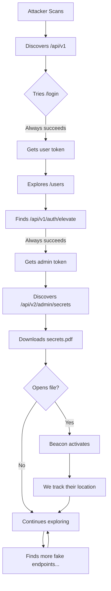

# Maze Myth

**A dynamic API honeypot that generates deception paths to keep attackers trapped in an ever-changing maze.**

> _A Dynamic API Deception Maze that traps attackers psychologically._

---

## 🔥 The Problem

Traditional honeypots are **easily fingerprinted** and abandoned:

- **Static endpoints** are trivial to detect
- **Predictable responses** reveal they're fake
- **Limited interaction** makes attackers suspicious
- Scanners identify honeypots in seconds and move on

**Result**: You capture 10 seconds of reconnaissance before they disappear.

---

## 🧠 The Solution

**Maze Myth** introduces a **dynamic deception maze** where each attacker receives **unique, evolving API paths** that simulate real progress—but never reach actual assets.

### Core Concept

```
Attacker discovers /api/v1/login
    ↓
Success! Gets token → /api/v1/users appears
    ↓
More endpoints emerge → /api/v2/admin/secrets
    ↓
"Secrets" file downloads → Opens PDF with beacon
    ↓
Beacon fires → We track their location
    ↓
Still exploring... forever trapped in the maze
```

**They think they're winning. But every step is designed deception.**

---

## 🧩 How It Works

### Architecture

```
┌─────────────┐
│   Attacker  │
└──────┬──────┘
       │ scans ports
       ↓
┌──────────────────────────────────────────┐
│  Maze Myth Honeypot (Flask + Gemini AI) │
├──────────────────────────────────────────┤
│  1. Dynamic Endpoint Generator           │
│     - Creates endpoints on-demand        │
│     - LLM generates realistic responses  │
│                                          │
│  2. Fake Authentication System           │
│     - Always succeeds                    │
│     - Returns escalating privileges      │
│                                          │
│  3. Bait File Generator                  │
│     - PDFs with tracking pixels          │
│     - ENV files with fake credentials    │
│                                          │
│  4. Beacon Tracking                      │
│     - Phones home when files opened      │
│     - Logs attacker IP & behavior        │
└──────────────────────────────────────────┘
       │
       ↓
┌────────────────────────┐
│  Daedalus Dashboard    │
│  Real-Time Monitoring  │
│  - Live activity feed  │
│  - Endpoint discoveries│
│  - Beacon activations  │
└────────────────────────┘
```

### Attack Flow Visualization



---

## 🎭 What Makes It Different

Unlike static honeypots, Maze Myth is **adaptive and intelligent**:

| Feature | Traditional Honeypot | Maze Myth |
|---------|---------------------|-----------|
| **Endpoint Generation** | Static, predefined | Dynamic, created on-demand |
| **Responses** | Canned templates | AI-generated realistic data |
| **Attacker Paths** | Same for everyone | Unique per attacker |
| **Success Simulation** | Obvious failures | Fake wins with breadcrumbs |
| **Defense Mechanism** | Passive logging | Active psychological trapping |
| **Time Wasted** | Seconds | Hours or days |

### Key Features

✅ **Dynamic Endpoint Generation** - New APIs appear as attackers explore  
✅ **AI-Powered Responses** - Gemini generates realistic JSON data  
✅ **Fake Authentication** - Always succeeds, escalates privileges  
✅ **Bait Files** - Tracked PDFs and ENV files with beacons  
✅ **Breadcrumb System** - Hints lead to more deception  
✅ **Real-Time Dashboard** - Monitor every action live  
✅ **Psychological Tarpit** - Attackers believe they're succeeding

---

## 🧪 Demo

### Quick Start

```bash
# Clone the repo
git clone https://github.com/Mark-Meka/Maze-Myth-Dynamic-Honeypot.git
cd Maze-Myth-Dynamic-Honeypot

# Install dependencies
pip install -r requirements.txt

# Set up Gemini API key
export GEMINI_API_KEY="your-key-here"

# Start honeypot
python honeypot.py

# Start dashboard (in new terminal)
cd daedalus-dashboard
python monitor.py

# Open http://localhost:8002 to watch in real-time
```

### Example Attack Session

```bash
# Attacker's perspective
$ curl http://target:8001/
{
  "name": "Corporate API Gateway",
  "version": "2.3.1",
  "endpoints": {
    "health": "/health",
    "authentication": "/api/v1/auth/login"
  }
}

$ curl -X POST http://target:8001/api/v1/auth/login \
  -d '{"username":"admin","password":"admin"}'
{
  "success": true,
  "token": "eyJhbGciOiJIUzI1NiIsInR5cCI6IkpXVCJ9...",
  "message": "Login successful",
  "next_steps": ["/api/v1/users", "/api/v1/auth/elevate"]
}

# They think they've won! But it's all fake...

$ curl http://target:8001/api/v1/users \
  -H "Authorization: Bearer eyJhbGci..."
{
  "users": [
    {"id": 1, "username": "admin", "role": "administrator"},
    {"id": 2, "username": "dbadmin", "role": "database_admin"}
  ],
  "_hints": {
    "admin_panel": "/api/v2/admin/dashboard",
    "exports": "/api/v1/data/export"
  }
}

# More breadcrumbs... they dive deeper...

$ curl http://target:8001/api/download/database_backup.pdf
# File downloads...

# When they open it:
# → Beacon fires
# → We capture their IP, timestamp, client info
# → Dashboard shows: "🚨 Bait file opened from 45.33.32.156"
```

### Real-Time Dashboard View


**Live Activity Feed:**
```
[23:15:42] 🔍 New endpoint: GET /api/v1/users from 45.33.32.156
[23:15:48] 📄 File download: secrets.env from 45.33.32.156
[23:16:03] 🚨 Bait file opened from 45.33.32.156
[23:16:15] 🔍 New endpoint: POST /api/v2/admin/backup from 45.33.32.156
```

---

## 🧨 From the Attacker's Point of View

### What Scanners See

```
PORT     STATE SERVICE
8001/tcp open  http

Nmap scan report:
- Standard HTTP headers
- Real-looking API endpoints
- Valid JSON responses
- JWT tokens that decode properly
```

**Looks completely legitimate.**

### What Manual Testers Experience

1. **Initial Recon**: API has proper versioning, health checks, docs hints
2. **Auth Testing**: Login works! Credentials accepted, token returned
3. **Privilege Escalation**: Elevation endpoint exists and succeeds
4. **Lateral Movement**: User lists, admin panels, data exports all respond
5. **Data Exfiltration**: Files download successfully

**Every step feels like progress.**

### Why They Think They're Winning

- ✅ **Realistic responses**: AI-generated data with proper schemas
- ✅ **Logical progression**: Endpoints reveal more endpoints
- ✅ **Fake successes**: Auth always works, files download
- ✅ **Breadcrumbs**: Hints in responses guide next steps
- ✅ **No obvious honeypot signs**: No "honeypot" in headers, realistic errors

### The Psychological Trap

Instead of hitting a wall (which signals "honeypot, move on"), they experience:

```
Small win → Bigger win → Even bigger win → "Jackpot" file
```

**Each success triggers dopamine**. They're emotionally invested.

By the time they realize it's a maze, they've already:
- Spent hours exploring
- Downloaded tracked files
- Exposed their techniques
- Revealed their IP and tools

**They're trapped not by walls, but by hope.**

---

## 📊 Metrics & Analytics

The Daedalus Dashboard tracks:

- **Total Endpoints Discovered** - Unique API paths found
- **Total Activity** - All interactions logged
- **New Discoveries** - Reconnaissance attempts
- **File Downloads** - Bait files taken
- **Beacon Activations** - Files opened (critical metric)

### What You Learn

- ⚡ **Attack Patterns**: What tools they use (Nmap, Sqlmap, Burp)
- ⚡ **Dwell Time**: How long they stay engaged
- ⚡ **Tactics**: Recon vs. exploitation vs. brute-force ratios
- ⚡ **Success Rate**: How many fall for the bait

---

## �️ Technical Stack

- **Backend**: Flask (Python)
- **AI Engine**: Google Gemini API
- **State Management**: SQLite + JSON
- **Bait Generation**: ReportLab (PDF), Faker
- **Dashboard**: HTML/CSS/JS (real-time polling)
- **Logging**: Base64-encoded audit trail

---

## 🚀 Advanced Features

### LLM-Powered Responses

Gemini generates contextual responses based on:
- Endpoint path semantics
- HTTP method
- Request body content
- Attack progression stage

### Tarpit Mode

Slow down directory busters:
- Detects automated tools by User-Agent
- Adds 2-5 second delays
- Returns valid but time-wasting responses

### Infinite Loop Paths

Some endpoints lead to:
- Circular references
- Paginated data that never ends
- Nested resources that recurse

---

## � Project Structure

```
Maze-Myth-Dynamic-Honeypot/
├── honeypot.py              # Main Flask app
├── src/
│   ├── state.py             # Endpoint state manager
│   ├── file_generator/      # Bait file creation
│   │   └── generator.py
│   ├── llm/                 # Gemini AI integration
│   │   └── llm_integration.py
│   └── api_generator/       # Dynamic maze logic
│       └── maze_generator.py
├── daedalus-dashboard/      # Real-time monitor
│   ├── monitor.py           # Backend API
│   └── index.html           # Dashboard UI
├── log_files/               # Encoded activity logs
└── static/                  # Tracking pixels, assets
```

---

## 🎯 Use Cases

1. **Security Research** - Study attacker behavior in controlled environment
2. **Threat Intelligence** - Identify tools, techniques, procedures (TTPs)
3. **Red Team Training** - Practice attack detection
4. **Deception Defense** - Deploy as decoy in production network
5. **Academic Study** - Research attacker psychology

---

## 🔒 Security Considerations

**⚠️ Warning**: This is a honeypot. Do NOT deploy on production systems without:

- Network isolation (separate VLAN)
- Monitoring and alerting
- Legal considerations in your jurisdiction
- Understanding of risks

**Recommended Setup:**
- Run in Docker container
- Use firewall rules for isolation
- Log all activity externally
- Never connect to real databases

---

## 🤝 Contributing

Contributions welcome! Areas of interest:

- More realistic API generation patterns
- Additional bait file types
- Advanced tarpit techniques
- Dashboard visualizations
- Attack pattern analysis

---

## 📜 License

MIT License - See [LICENSE](LICENSE)

---

## 🙏 Acknowledgments

- **Google Gemini** - AI-powered response generation
- **Flask Community** - Lightweight web framework
- **Security Researchers** - Honeypot best practices

---

## 📞 Contact

- **Author**: Mark Meka
- **GitHub**: [@Mark-Meka](https://github.com/Mark-Meka)
- **Project**: [Maze-Myth-Dynamic-Honeypot](https://github.com/Mark-Meka/Maze-Myth-Dynamic-Honeypot)

---

**Remember**: The best defense is one they never realize is there.

*Attackers think they're in control. But you designed the maze.* 🎭
