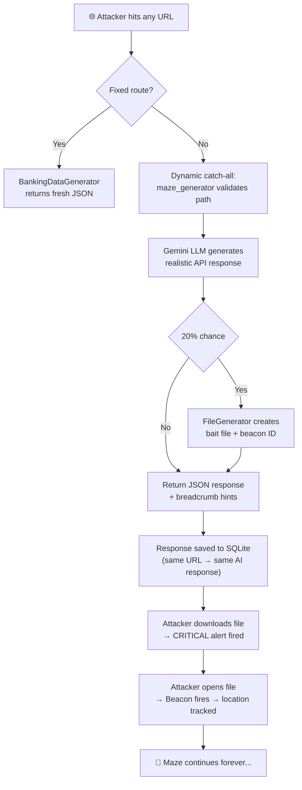
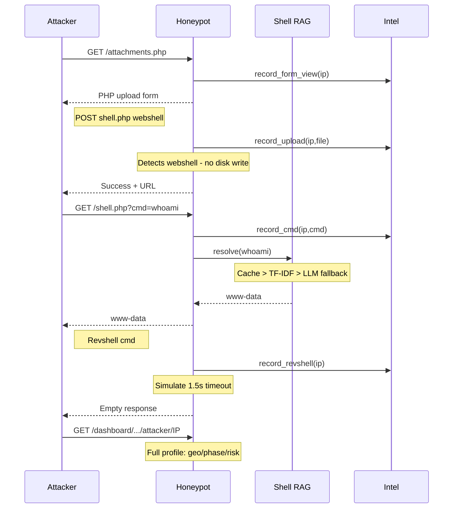
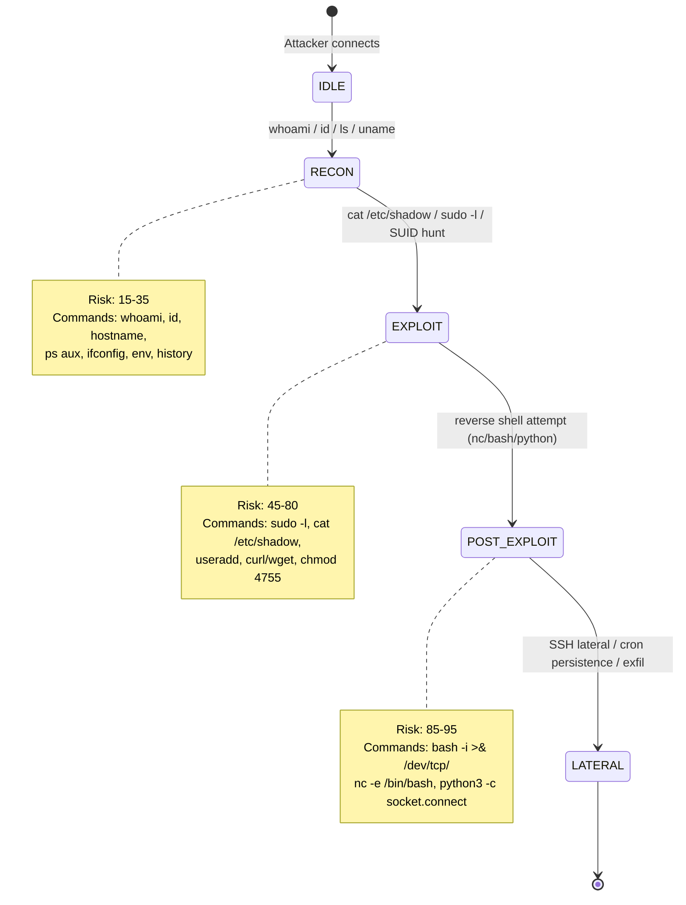

# Maze Myth — Dynamic Banking Honeypot

> **A real-time deception platform that traps attackers in an AI-powered banking maze, analyzes their behavior, and never lets them know they're caught.**

---

## 🔥 The Problem

Traditional honeypots are **easily fingerprinted**:
- Static endpoints → trivially detected
- Predictable responses → reveal fakeness in seconds
- No file upload or webshell simulation
- Zero attacker behavior profiling

**Result**: You capture 10 seconds of recon before they disappear.

---

## 🧠 The Solution

**Maze Myth** combines three deception layers:

| Layer | What it does |
|-------|-------------|
| **Dynamic API Maze** | Infinite AI-generated endpoints — every attacker sees different data |
| **CVE-2020-36179 Trap** | Fake file upload RCE — accepts webshells, simulates execution with AI responses |
| **Attacker Intelligence** | Profiles every attacker: geo, phase, risk scores, and deception advice |

---

## 🗺️ How the Attack Flow Works

### Layer 1 — API Maze (Always Active)


```mermaid
flowchart TD
    A["🌐 Attacker hits any URL"] --> B{Fixed route?}
    B -- Yes --> C["BankingDataGenerator\nreturns fresh JSON"]
    B -- No --> D["Dynamic catch-all:\nmaze_generator validates path"]
    D --> E["Gemini LLM generates\nrealistic API response"]
    E --> F{20% chance}
    F -- Yes --> G["FileGenerator creates\nbait file + beacon ID"]
    F -- No --> H["Return JSON response\n+ breadcrumb hints"]
    G --> H
    H --> I["Response saved to SQLite\n(same URL → same AI response)"]
    I --> J["Attacker downloads file\n→ CRITICAL alert fired"]
    J --> K["Attacker opens file\n→ Beacon fires → location tracked"]
    K --> L["🔁 Maze continues forever..."]
```

---

### Layer 2 — CVE-2020-36179 File Upload Trap


```mermaid
sequenceDiagram
    participant A as Attacker
    participant H as Honeypot
    participant RAG as Shell RAG
    participant I as Intel

    A->>H: GET /attachments.php
    H->>I: record_form_view(ip)
    H-->>A: PHP upload form

    Note right of A: POST shell.php webshell
    H->>I: record_upload(ip,file)
    Note over H: Detects webshell - no disk write
    H-->>A: Success + URL

    A->>H: GET /shell.php?cmd=whoami
    H->>I: record_cmd(ip,cmd)
    H->>RAG: resolve(whoami)
    Note over RAG: Cache > TF-IDF > LLM fallback
    RAG-->>H: www-data
    H-->>A: www-data

    Note right of A: Revshell cmd
    H->>I: record_revshell(ip)
    Note over H: Simulate 1.5s timeout
    H-->>A: Empty response

    A->>H: GET /dashboard/.../attacker/IP
    Note over H: Full profile: geo/phase/risk
```

---

### Layer 3 — Attacker Intelligence Engine


```mermaid
flowchart LR
    subgraph Events["📡 Recorded Events"]
        E1["Form View"]
        E2["File Upload\n(safe/dangerous/webshell)"]
        E3["?cmd= execution\n(risk scored 0-100)"]
    end

    subgraph Session["🧠 AttackerSession"]
        S1["IP Geolocation\n(country, ISP, VPN?)"]
        S2["Attack Phase\nIDLE→RECON→EXPLOIT→POST_EXPLOIT→LATERAL"]
        S3["Engagement Score\n0-100"]
        S4["File Analysis\n(18 pattern tags)"]
        S5["Command Timeline\n(risk-sorted)"]
    end

    subgraph Output["📊 Dashboard Output"]
        D1["Global Stats"]
        D2["Top Attackers by Engagement"]
        D3["Phase Distribution"]
        D4["Deception Advisor\n(how to keep attacker longer)"]
        D5["Per-IP Deep Profile"]
    end

    Events --> Session
    Session --> Output
```

---

### Attack Phase Classification


```mermaid
stateDiagram-v2
    [*] --> IDLE : Attacker connects
    IDLE --> RECON : whoami / id / ls / uname
    RECON --> EXPLOIT : cat /etc/shadow / sudo -l / SUID hunt
    EXPLOIT --> POST_EXPLOIT : reverse shell attempt (nc/bash/python)
    POST_EXPLOIT --> LATERAL : SSH lateral / cron persistence / exfil
    LATERAL --> [*]

    note right of RECON
        Risk: 15-35
        Commands: whoami, id, hostname,
        ps aux, ifconfig, env, history
    end note

    note right of EXPLOIT
        Risk: 45-80
        Commands: sudo -l, cat /etc/shadow,
        useradd, curl/wget, chmod 4755
    end note

    note right of POST_EXPLOIT
        Risk: 85-95
        Commands: bash -i >& /dev/tcp/
        nc -e /bin/bash, python3 -c socket.connect
    end note
```

---

## ✅ Feature Status

| # | Feature | Status |
|---|---------|--------|
| 1 | Docker + Gunicorn containerization | ✅ Done |
| 2 | SQLite state (WAL mode) | ✅ Done |
| 3 | AI-generated banking API responses & files (Gemini) | ✅ Done |
| 4 | Multi-format tracked bait files + beacons | ✅ Done |
| 5 | CVE-2020-36179 File Upload RCE deception | ✅ Done |
| 6 | Hybrid Shell RAG Engine (Cowrie + Gemini) | ✅ Done |
| 7 | Attacker Intelligence & Behavior Profiling | ✅ Done |
| 8 | LLM Offline Fallback (Ollama) | 🔜 Planned |
| 9 | Webhook + SIEM Alerts | 🔜 Planned |
| 10 | Tarpit Mode | 🔜 Planned |

---

## 🚀 Key Features

### 1. Dynamic API Maze
Every attacker sees different data. Infinite endpoint generation:
- **Companies**: 8–20 per call | **Accounts**: 15–40 | **Transactions**: 20–100
- Gemini LLM generates realistic JSON for unknown paths
- Same URL always returns the same AI response (consistency)

### 2. CVE-2020-36179 File Upload Trap
Simulates a vulnerable banking document upload portal:
- **Two realistic endpoints**: Spring (Java compliance portal) + PHP (client support)
- **Only real webshell payloads** trigger the execution trap
- **Fake webshell execution**: AI generates realistic shell output
- **No files ever written to disk**

### 3. Hybrid Shell RAG Engine
Generates reverse shell responses using Cowrie honeypot dataset + Gemini:
- **58 ground-truth** commands (always correct, www-data identity)
- **TF-IDF fuzzy matching** on 235 real Cowrie attacker sessions
- **Gemini LLM fallback** for novel commands (cached per session)
- Consistent responses — only changes on server restart

### 4. Attacker Intelligence Dashboard

```
GET /api/dashboard/cve/file-upload           → Full intel summary
GET /api/dashboard/cve/file-upload/attackers → All attacker profiles
GET /api/dashboard/cve/file-upload/attacker/<ip> → Deep per-IP profile
```

### 5. Multi-Format Bait Files
`.pdf`, `.xlsx`, `.csv`, `.xml`, `.json`, `.js`, `.db`, `.sqlite`, `.txt` — all with embedded beacon tracking.

---

## 📁 Architecture

```
Maze-Myth-Dynamic-Honeypot/
│
├── honeypot.py               ← Main Flask application (all routes)
├── run_honeypot.bat          ← Windows: double-click to start
│
├── src/
│   ├── file_upload_rce.py    ← CVE-2020-36179 deception module
│   ├── attacker_intel.py     ← Behavior analysis & profiling engine 
│   ├── api_generator/        ← Maze routing & access control
│   ├── data_generator/       ← Fake banking data generation
│   ├── file_generator/       ← Tracked bait files with beacons
│   ├── llm/                  ← Gemini API integration
│   ├── rag/
│   │   ├── rag_loader.py     ← Banking domain context
│   │   ├── shell_rag_loader.py ← Shell command RAG engine 
│   │   └── shell_rag.pkl     ← Trained Cowrie model
│   └── state/                ← SQLite persistence (WAL)
│
├── dashboard/                ← Operator monitoring UI
│   ├── index.html            ← Dashboard UI (port 8002)
│   └── monitor.py            ← Dashboard Flask backend
│
└── Dataset/                  ← Training data
    ├── shell_rag.pkl         ← Cowrie-trained command model
    └── ai_cmd_cache.json     ← Gemini-generated command cache

```

---

## 🚀 Quick Start

### Option A — Docker (Production)

```bash
git clone https://github.com/Mark-Meka/Maze-Myth-Dynamic-Honeypot.git
cd Maze-Myth-Dynamic-Honeypot
cp .env.template .env
# Edit .env: add GEMINI_API_KEY=your_key_here
docker compose -f docker/docker-compose.yaml up -d
```

### Option B — Windows Local

```
Double-click run_honeypot.bat
```

### Option C — Windows/Linux Manual Setup

1. **Install Python requirements**:
   ```bash
   pip install -r requirements.txt
   ```

2. **Configure Gemini Artificial Intelligence**:
   The honeypot uses a Google Gemini LLM API key to dynamically generate hyper-realistic HTTP responses, CSV, SQLite schema, JSON baits, and reverse shell commands.
   ```bash
   # Copy the template variables
   cp .env.template .env
   
   # Open .env in your text editor and paste your API key:
   # GEMINI_API_KEY="AIzaSy...your-gemini-key-here..."
   ```

3. **Start the applications**:
   ```bash
   # Terminal 1 (The Honeypot Catching Attackers)
   python honeypot.py
   
   # Terminal 2 (The Intelligence Dashboard for Operators)
   python dashboard/monitor.py
   ```

| Service      | URL                                                 | Audience                |
| ------------ | --------------------------------------------------- | ----------------------- |
| 🎯 Honeypot  | http://localhost:8001                               | Attackers (expose this) |
| 📊 Dashboard | http://localhost:8002                               | Operators only          |
| 🔍 Intel API | http://localhost:8001/api/dashboard/cve/file-upload | Operators only          |

---

## 🎭 Full Attack Scenario

1. **Discovery** — Attacker finds `/api/v1/auth/login`. Gets JWT + hint to `/api/v1/users`
2. **Exploration** — Lists users, accounts, transactions. Finds `/api/v2/admin/secrets`
3. **File Theft** — Downloads `encryption_keys.json` → beacon fires → attacker tracked
4. **Upload Exploit** — Finds `/clientportal/support/attachments.php`, uploads `shell.php`
5. **Webshell** — Runs `whoami`, `cat /etc/passwd`, `env` — all answered by AI
6. **Reverse Shell** — Tries `bash -i >& /dev/tcp/...` → simulated hang
7. **Dashboard** — Operator sees full profile: country, ISP, phase=POST_EXPLOIT, risk=95, deception advice

---

## 🔒 Security Warning

> ⚠️ This is a deception tool. Run in an **isolated environment** (VM/container/VLAN).  
> **Never expose port 8002** — it is for operators only. Use SSH tunneling to view remotely.

---

## 📜 License

MIT License — See [LICENSE](LICENSE)

## 📞 Contact

- **Author**: Mark Meka | **GitHub**: [@Mark-Meka](https://github.com/Mark-Meka)
